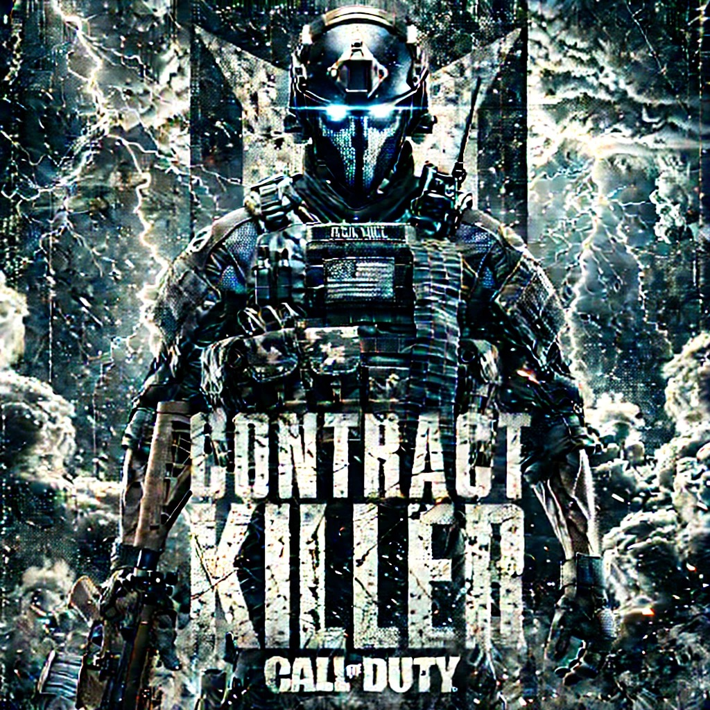
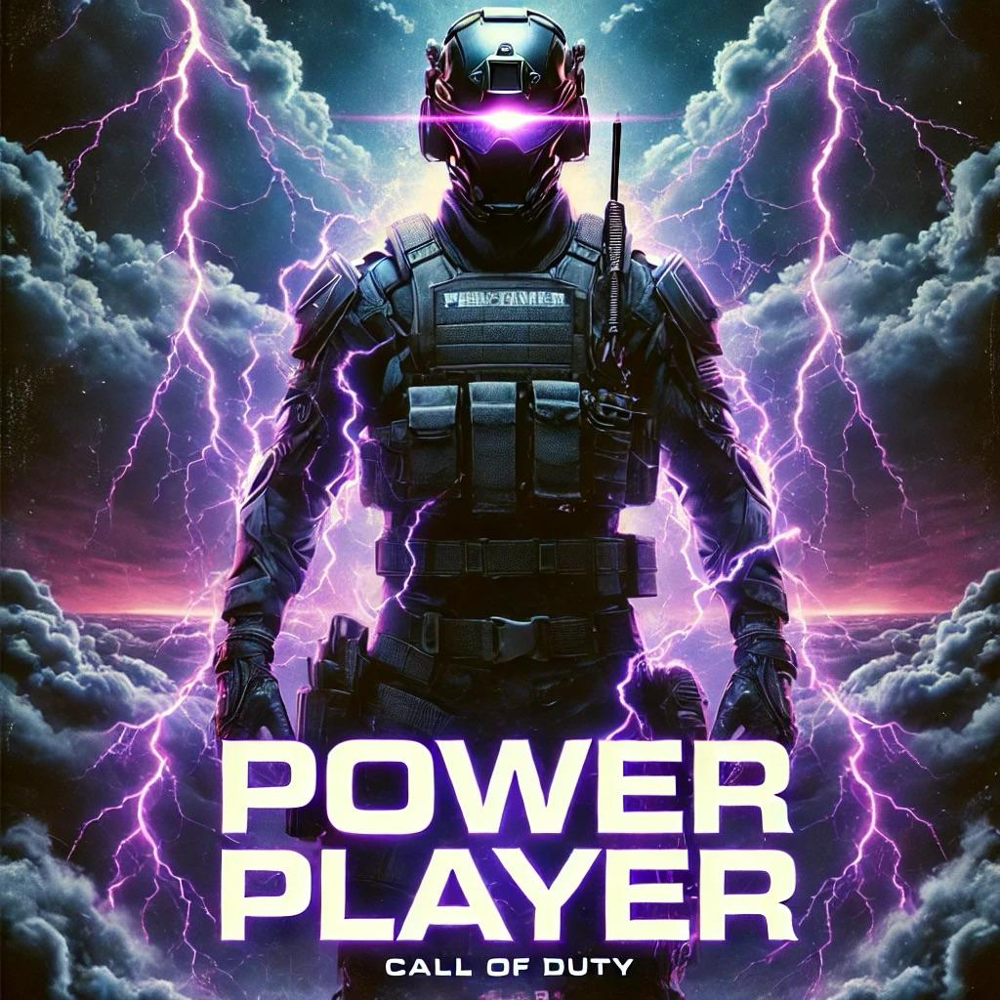

# Tournament Format

## Group Stage

- Best 8 out of 12 games
- A minimum of 4 games per session must be played at time of team announcing their runs to reduce lobby manipulation and team stalling and ensure proper flow of the tournament
<!-- - Top 3 teams advance to next round
- Top team will get a bye
-->

## Quarter-Finals

- Losers bracket will be between 4th and 5th seed
- Best score in 3 out of 4 games

## Semi-Finals

- Best 8 out of 12 games
- 1 seed vs 4/5 seed — winner advances 
- 2 seed vs 3 seed — winner advances 

## Finals

- Best 8 out of 12 games
- Kill List Championship round 

## Tournament Scoring System

### Kill Score

- 1 kill = 1 point

### Game Placement Bonus

**NOTE: Requires at least 2 members of team to be alive at time of placement with exception being a wz victory.**

- 1st = 15 Points
- 2nd = 5 Points
- 3rd = 3 Points
- 4th = 2 Points
- 5th = 1 Point

### Bonus Points Scoring

In an effort to make the tournament gameplay more interesting, engaging, compelling, and competitive we have designed additional ways to gain extra points to add to your teams scorecard. **Remember, bonuses can be stacked.**

#### Contract Killer Bonus

  

Killing bounty contract will count as 3 points as opposed to a 1 point regular kill (bounties that are poached will not count)

#### Power Player

  

Prior to start of game team may designate one of their players as a power player. This players final point total will be x2. A player can only be designated twice in the entire tournament as the power player so strategize and use wisely.

#### Frenemy Fire Bonus

  

Keep your enemies close but your friends even closer. High risk, high reward bonus scoring.

Killing an opposing tournament team player will come with a 4x bonus (ie will count as 4 points instead of normal 1 point) and result in -1 for the killed player. Completing a team wipe of an opposing team will result in -5 points for wiped team.
