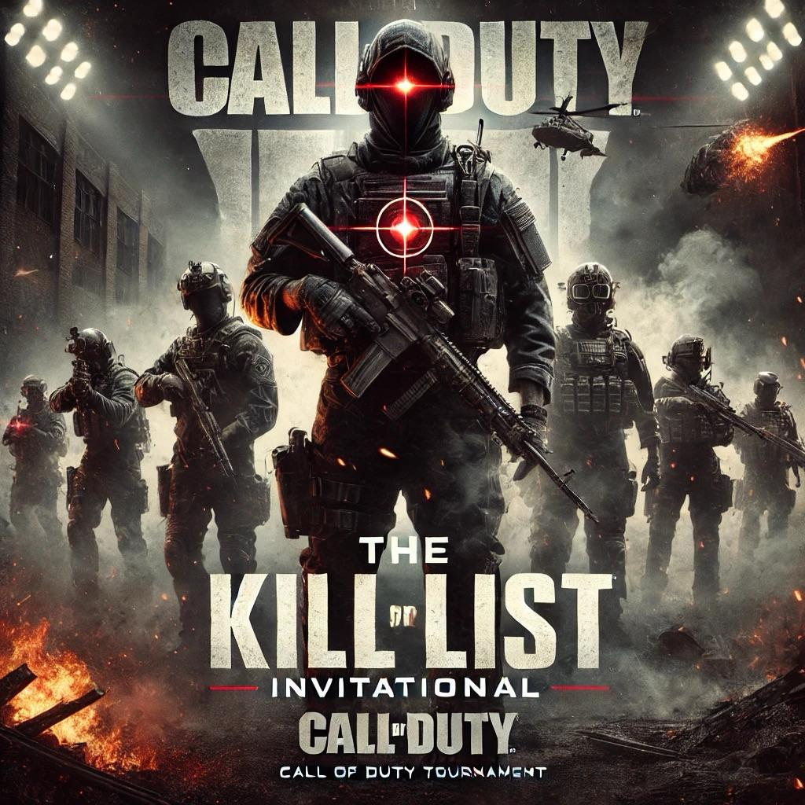
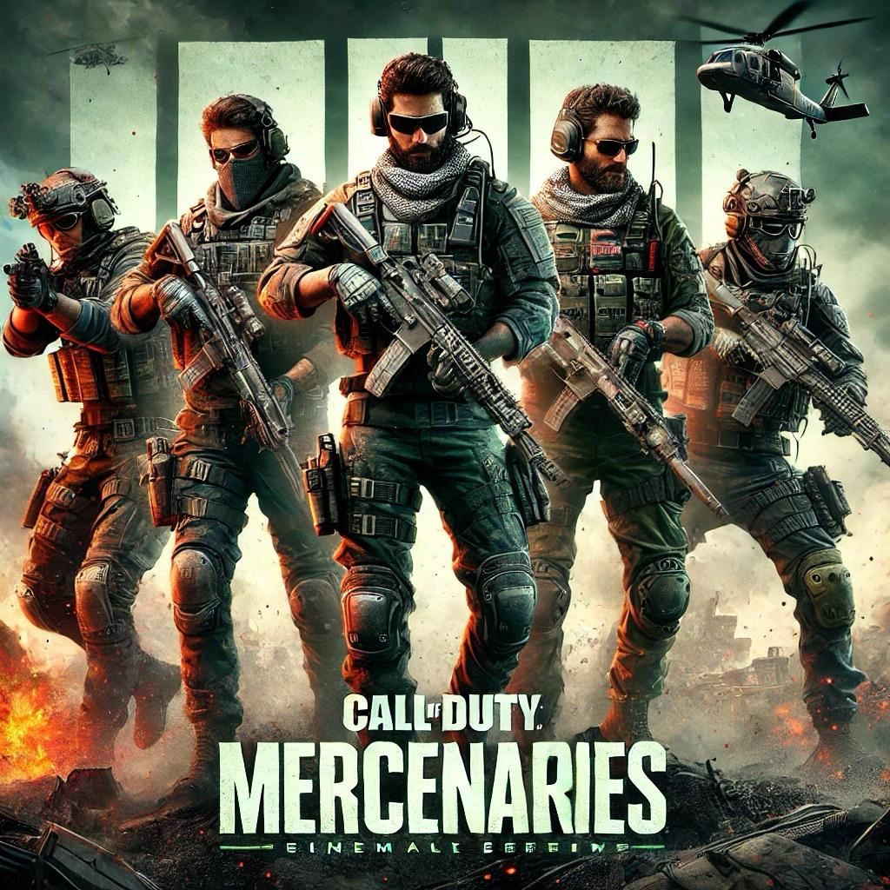
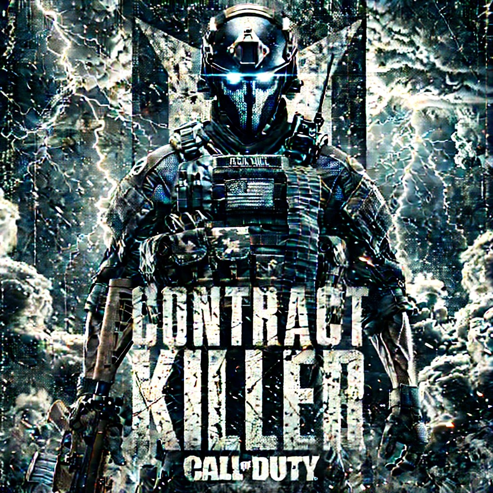
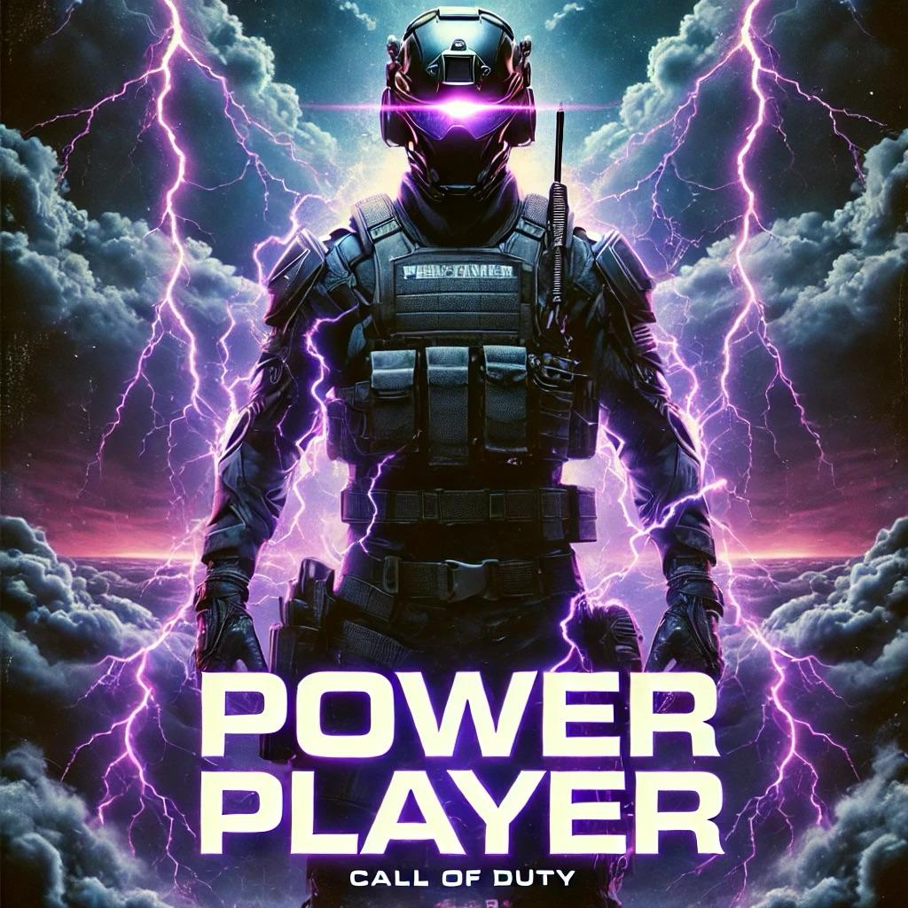
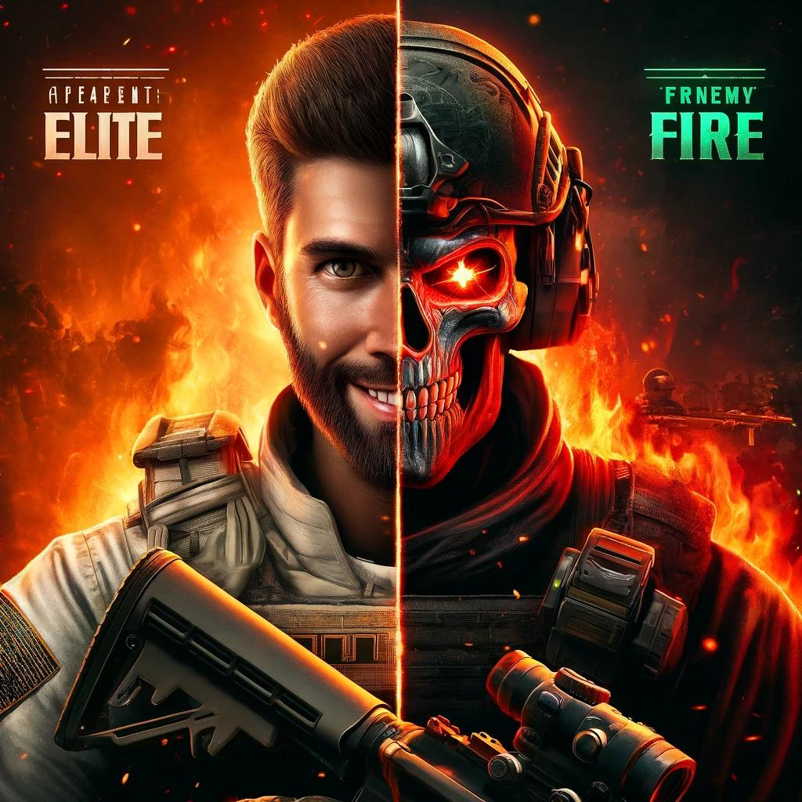

# WZ Tourney #5: The Kill List Invitational

  

<!--
## Submit Your Score
[Submit Tourney Scores](https://bit.ly/wztourney)

## Tournament Individual Stats
[WZ Tourney Stats](https://bit.ly/wztourneystats)

## Tournament Results
<iframe src="https://brackethq.com/b/2ywub/embed/" width="100%" height="550" frameborder="0"></iframe>
-->

### Teams

Teams will be a set of trio. Initially, the team will be put together by tournament coordinators. But the duo teammates will have an opportunity to choose their third from the Mercenary List.

- Team Jabz - Jabz, Lorax
- Team Manoof - Manoof, Oat
- Team Skeebs - Skeebs, Chowder
- Team Bok - Hotel, Bok
- Team Z - **TBD**

## Mercenary Selection List

  

The following players have been labeled as Mercenaries - elite killers selected by the tournament coordinators based on a number of factors including aggressive play style, past tournament kill totals, and past tournament wins.

The list is as follows:

- Mushdawg
- Shawny
- Riaz 
- Hell4Warrior
- Iboo

These five Mercenaries will be selected by draft. Date of draft will coincide with date of NFL draft 4/23. 

The remainder of you Grunts will be required to pair up as duos of your own choosing and submit their team name to tournament coordinators by 0100 4/23/25

## Tournament Run Dates

**TBD**
<!-- 01/10 - 01/31

- **COMPLETED** First Round: Wednesday, Jan 10th - ~~Wednesday, Jan 17th~~ Sunday, Jan 14th
- **Second Round:** Wednesday, Jan 17th - Wednesday, Jan 24th
-->

## Tournament Format

- [Details about tourney format](./Tourney%20Details/format.md)
- [Details about tourney requirements](./Tourney%20Details/requirements.md)

## Tournament Basic Rules

### First Round

- Best 8 out of 12 games
- A minimum of 4 games per session must be played at time of team announcing their runs to reduce lobby manipulation and team stalling and ensure proper flow of the tournament
- Top 3 teams advance to next round
- Top team will get a bye

### Loser Play-in

- Best score in 3 out of 4 games
- Losers bracket will be between 4th and 5th seed

### Second Round

- Best 8 out of 12 games
- 1 seed vs 4/5 seed — winner advances 
- 2 seed vs 3 seed — winner advances 

### Third Round

- Best 8 out of 12 games
- Kill List Championship round 

## Tournament Scoring System

### Kill Score

- 1 kill = 1 point

### Game Placement Bonus

**NOTE: Requires at least 2 members of team to be alive at time of placement with exception being a wz victory.**

- 1st = 15 Points
- 2nd = 5 Points
- 3rd = 3 Points
- 4th = 2 Points
- 5th = 1 Point

### Bonus Points Scoring

In an effort to make the tournament gameplay more interesting, engaging, compelling, and competitive we have designed additional ways to gain extra points to add to your teams scorecard. **Remember, bonuses can be stacked.**

#### Contract Killer Bonus

  

Killing bounty contract will count as 3 points as opposed to a 1 point regular kill (bounties that are poached will not count)

#### Power Player

  

Prior to start of game team may designate one of their players as a power player. This players final point total will be x2. A player can only be designated twice in the entire tournament as the power player so strategize and use wisely.

#### Frenemy Fire Bonus

  

Keep your enemies close but your friends even closer. High risk, high reward bonus scoring.

Killing an opposing tournament team player will come with a 4x bonus (ie will count as 4 points instead of normal 1 point) and result in -1 for the killed player. Completing a team wipe of an opposing team will result in -5 points for wiped team.

## Lobby Sync Rules

Teams deciding to sync will be allowed to restart games immediately if not synced without penalty. 

If teams decide to sync, and do successfully sync in game - this game MUST be counted and can not be a ‘thrown out’ game 

Teams playing 4 or more synced games will be provided a bonus of 2 counted games (top 10 instead of top 8 games will be counted)

Teams are not obligated to coordinate drops or fights in synced games but this is highly encouraged 

Accidental syncs found by killing fellow tournament players will result into a default counted game for both teams automatically 

Team wipe is defined as: 1) killing entire team at time of engagement (ie even if a squad member has gulag it will effectively be considered a team wipe) 2) sending last remaining player on squad to the gulag 3) true game ending team wipe.

## Team Responsibilities

All tournament participants are responsible to read and understand the rules before the tourney starts. All participants will have to abide by the rules, regardless of whether they have taken the time to read them ahead of the tourney. Regardless of circumstance, such as life or even the best intentions, the rules will be enforced. The intent of the rules and their enforcement is to prevent bickering, maintain the momentum of the tournament, and provide a fair playing field for all participating. Circumstances happen, don’t worry there will be more tournaments ahead of this one for you to try again.

## Tournament Moderators

- Lorax
- Shawny

---

**Remember this is for fun, don’t take it too seriously, but trash talking still encouraged.**
**The tournament is now open for runs. Good Luck and Happy Hunting**
